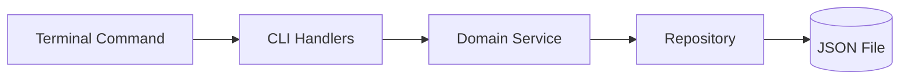

# 🏗️ Task CLI Architecture & Folder Structure Guide

**Project URL:** [https://roadmap.sh/projects/task-tracker](https://roadmap.sh/projects/task-tracker)

This document serves as an architectural overview of our `task-cli` Go project based on our industry standards. It explains the project's folder layout, coding patterns, and how data flow through the application.

---

## 📐 Architectural Pattern

The project follows a **Domain-Driven Design (DDD)** approach combined with **Hexagonal Architecture (Ports and Adapters)** principles.

Instead of heavily coupling the storage code to the CLI handlers, the application is divided into distinct layers:
1. **Core Domain:** Business models (`domain/`).
2. **Business Logic (Services):** Feature-specific logic (`task/`) which defines its own dependency requirements using interfaces (Ports).
3. **Adapters:** Implementations of those interfaces, like CLI controllers (`cli/`) for incoming terminal commands, and JSON Repositories (`repo/`) for outgoing data persistence.
4. **Composition Root:** Manual Dependency Injection wired up at application startup (`cmd/run.go`).

---

## 📂 Folder Structure Summary

```text
task-cli/
├── cmd/               # Application Entrypoint & Dependency Injection
│   └── run.go         # Composition Root: Wires DB, Repos, Services, and Handlers together
├── domain/            # Core business models/structs (e.g., Task)
├── task/              # `Task` feature domain (Business Logic)
│   └── service.go     # Implementation of the business logic and required interfaces
├── repo/              # Data persistence implementations (The "Adapters" for DB)
│   └── task_json.go   # JSON File operations for Tasks
├── cli/               # The Presentation Layer (Terminal)
│   ├── handlers.go    # CLI command routing (The Controller)
│   ├── add_task.go    # Logic for adding tasks
│   ├── update_task.go # Logic for updating tasks
│   ├── delete_task.go # Logic for deleting tasks
│   ├── mark_task.go   # Logic for marking task status
│   └── get_tasks.go   # Logic for listing/fetching tasks
├── go.mod             # Go module dependencies file
├── tasks.json         # Storage file for task tracking
└── main.go            # Simple execution root that triggers cmd.Run()
```

---

## 🔄 How the Code Works Together (Data Flow)

When a new terminal command comes in, it passes through the system sequentially:



1. **CLI Routing (`cli/handlers.go`)**: The system parses `os.Args` to handle routing based on the initial arguments (e.g. `add`, `update`, `delete`, `list`).
2. **Handlers (`cli/`)**: Receives the incoming command arguments, validates the input, and passes them to the corresponding *Domain Service*. Handlers **do not** write to the JSON file.
3. **Services (`task/`)**: Contains pure business logic. For example, the Task Service determines the next unique ID before telling the repository to save the task. Services are completely ignorant of *how* data is stored.
4. **Repositories (`repo/`)**: Receives calls from the Services and executes the actual read/write operations against the filesystem.
5. **Domain (`domain/`)**: Throughout this flow, the core data structs passed back and forth between layers are defined universally in the `domain/` directory.

---

## 💉 Dependency Injection Pipeline

We do not use messy global variables. Instead, all dependencies are explicitly injected downward at runtime inside `cmd/run.go`.

Here is the general lifecycle:
1. Initialize Repositories (Passing the filepath).
   * `repo.NewTaskJSONRepo("tasks.json")`
2. Initialize Domain Services (Passing the Repositories).
   * `task.NewService(taskRepo)`
3. Initialize Handlers (Passing the Services).
   * `cli.NewHandler(taskService)`
4. Execute the command parser.

### Why is this good?
Because everything relies on **consumer-defined interfaces** (defined locally in the packages that use them), **unit testing works flawlessly**. A Mock DB repository can easily be created and passed into the Task Service to test business logic instantly without touching the actual filesystem!

---

## 🚀 Getting Started

### Prerequisites
- [Go](https://go.dev/doc/install) (1.20 or later)

### Clone the Repository
To run this project locally, a user needs to clone it first:
```bash
git clone https://github.com/Ahad-41/Task-Tracker.git
cd Task-Tracker
```

---

## 🛠️ How to Use (Task Tracker CLI)

Ensure the application is built (`go build -o task-cli`). It can then be run from the terminal using `./task-cli`.

### Add a Task
Adds a new task to the list.
```bash
./task-cli add "Buy groceries"
```

### Update a Task
Updates the description of an existing task by its ID.
```bash
./task-cli update 1 "Buy groceries and cook dinner"
```

### Delete a Task
Removes a task from the list by its ID.
```bash
./task-cli delete 1
```

### Change Task Status
Mark a task as in-progress or done.
```bash
./task-cli mark-in-progress 1
./task-cli mark-done 1
```

### List Tasks
View all tasks, or filter them by their status.
```bash
./task-cli list
./task-cli list done
./task-cli list todo
./task-cli list in-progress
```
